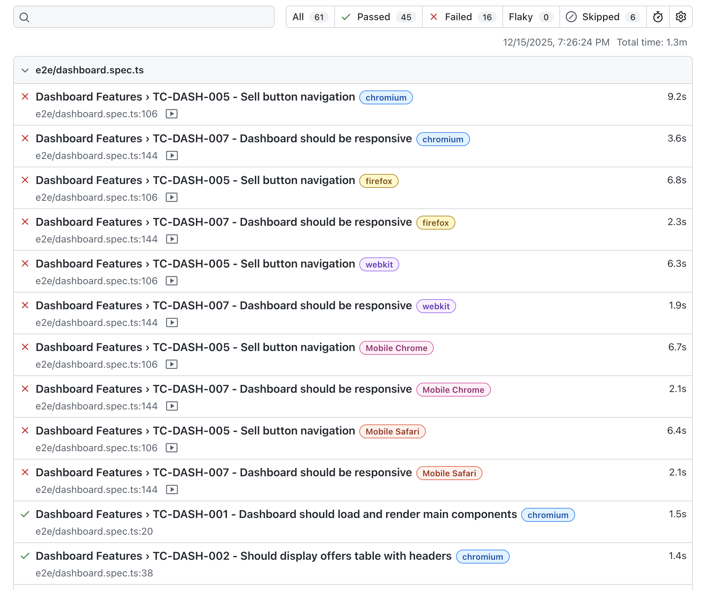

# DEX Testing

- **E2E Tests**
- **API Tests**
- **Security Tests**
- **Performance Tests**

**Total tests: 67 (across 5 browsers)**
- **Pass: 45**
- **Fail: 16 (expected as backend is not connected)**
- **Skip: 6 (expected as backend is not connected)**



---

### Prerequisites
```bash

# Ensure dependencies are installed
npm install

# Browsers will be installed automatically
npx playwright install
```

### Running Tests

```bash
# Run all tests
npm test

# Run in headed mode
npm run test:headed

# Interactive UI mode
npm run test:ui

# Debug mode
npm run test:debug

# Run only E2E tests
npm run test:e2e

# Run only API tests
npm run test:api

# View test report
npm run test:report
```

### HTML Report
```bash
npm run test:report
# Opens playwright-report/index.html in browser
```

### JSON Report
```
test-results/results.json
```

### Screenshots & Videos
Failed tests automatically capture:
- Screenshots: `test-results/`
- Videos: `test-results/videos/`
- Traces: Available for debugging

## Configuration

### Playwright Config (`playwright.config.ts`)

```typescript
{
  testDir: './tests',
  timeout: 30000,
  retries: 0,
  workers: undefined, // Parallel execution
  
  use: {
    baseURL: 'http://localhost:3000',
    apiURL: 'http://localhost:3002',
    screenshot: 'only-on-failure',
    video: 'retain-on-failure',
  },
  
  projects: [
    { name: 'chromium' },
    { name: 'firefox' },
    { name: 'webkit' },
    { name: 'Mobile Chrome' },
    { name: 'Mobile Safari' },
    { name: 'api' }, // API-only tests
  ]
}
```